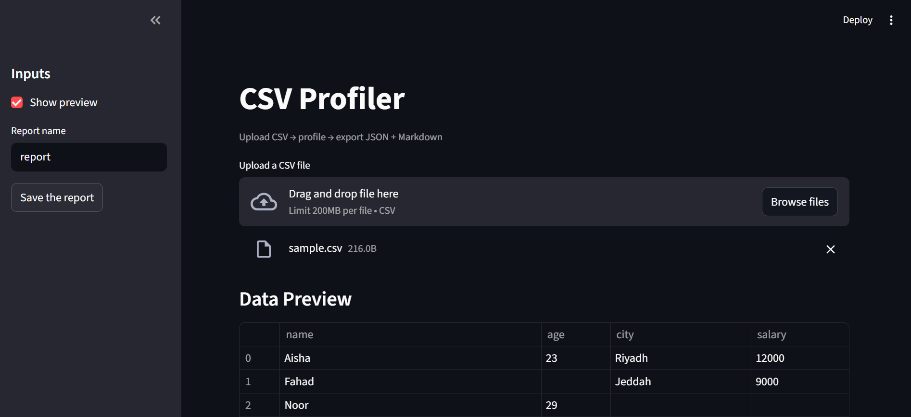

# CSV Profiler

A Python tool to profile CSV files, providing summaries, column statistics, and markdown/JSON reports.

## Installation

Clone the repository:

```bash
git clone https://github.com/ghyoudh/bootcamp.git
cd csv-profiler
uv install
```

## run 
```bash 
uv run python main.py data/sample.csv
```
# App Interface 


## Installation

Clone the repository:

```bash
git clone https://github.com/ghyoudh/bootcamp.git
cd csv-profiler
uv install
```

## run 
```bash 
python -m streamlit run src/interfaces/app.py
```

## Output Screenshot

